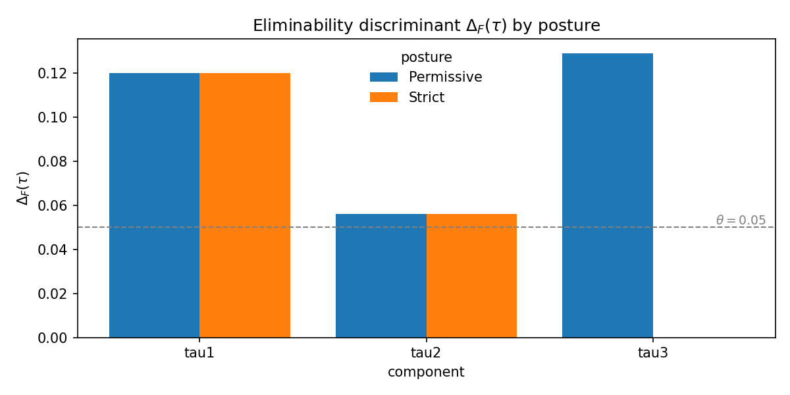
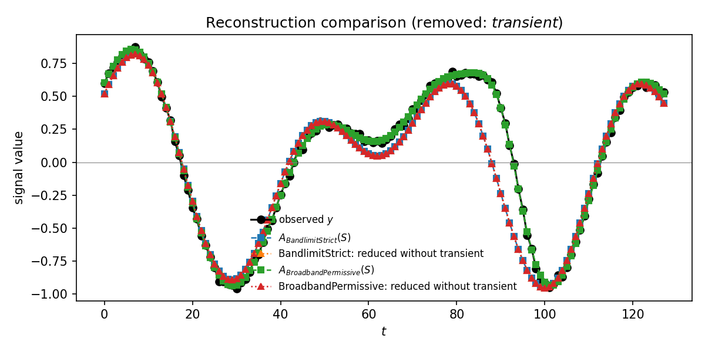
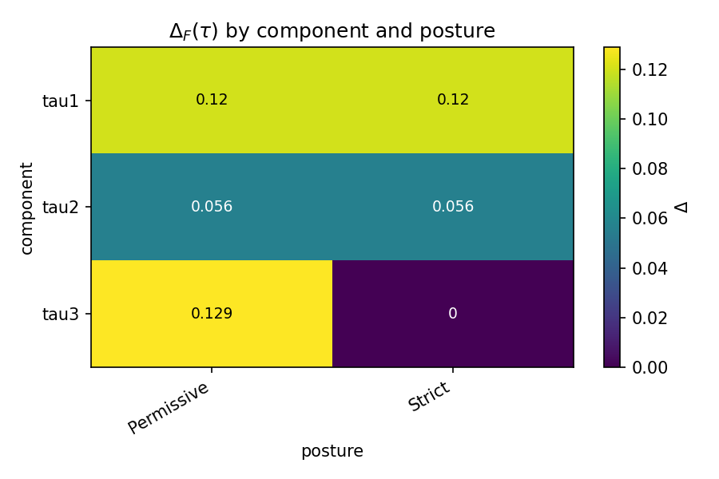
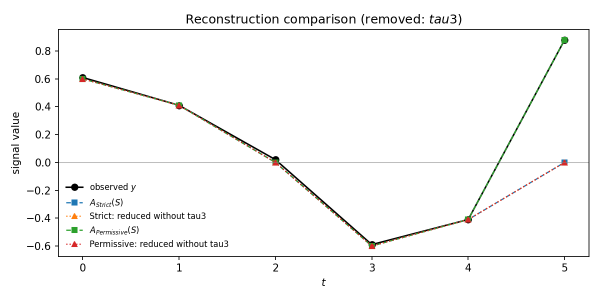

# Eliminability Diagnostic

*A reproducible implementation of the Eliminability Discriminant from "Evaluation Dependence in Quantum Measurement," demonstrating when apparent eliminability is evaluation-posture dependent rather than structurally invariant.*

**Given a signal, a fixed set of candidate components, and two or more evaluation postures, the tool tells you which components are eliminable under each posture and which register as _evaluation dependent_ — eliminable under one posture, indispensable under another.**

The diagnostic is posture aware: the same component can be flagged as dispensable by a strict evaluator and as necessary by a permissive one, under identical input and identical candidate set. The tool quantifies that disagreement in a single scalar per component.

*Example use.* An analyst is deciding whether to retain a localized transient in a signal model. Strict bandlimit criteria classify the transient as inadmissible noise; broadband fidelity criteria classify it as part of the data. The discriminant quantifies that disagreement as a single number and exposes it as an evaluation dependent component rather than forcing the analyst to pick one posture and hide the other.



```
component  delta[Strict]  delta[Permissive]  D[Strict, Permissive]  classification
tau1       0.120          0.120              0.000                  invariantly necessary
tau2       0.056          0.056              0.000                  invariantly necessary
tau3       0.000          0.129              0.129                  evaluation dependent
```

## Scope

This repository operationalizes a narrow structural claim: **posture dependent eliminability can be computed, classified, and regression tested over a fixed candidate set**. It does not implement the full FRAME architecture, does not resolve quantum interpretation debates, and does not replace decoherence theory or standard estimation methods. It provides a falsifiable diagnostic for evaluation dependence under fixed dynamics.

## Install

```bash
git clone <repo-url> eliminability_diagnostic
cd eliminability_diagnostic
pip install -e .
```

Or, without installing:

```bash
pip install -r requirements.txt
```

Python 3.9+. Dependencies: NumPy, pandas, matplotlib.

## Quick start

Run the bundled toy demo:

```bash
python main.py --demo toy
```

Or, if installed:

```bash
eliminability-diagnostic --demo toy
```

This reproduces the Section 5 example of the accompanying manuscript (numbers above) and writes a CSV, four PNG plots, and a textual summary to `./results/`.

For a research adjacent demo, run the infrasound transient example:

```bash
python main.py --demo infrasound
```

A synthetic single channel window with two bandlimited backgrounds and one narrow Gaussian transient is reconstructed under two postures: `BandlimitStrict` (excludes the transient) and `BroadbandPermissive` (retains it). The transient is flagged as evaluation dependent.



## Input

Two CSV files.

**signal.csv** — two columns, one row per time index:

```
t,y
1,0.610
2,0.410
3,0.020
4,-0.590
5,-0.410
6,0.880
```

**components.csv** — one row per candidate component. `v1..vn` are the component values aligned to the signal:

```
name,violates_constraint,v1,v2,v3,v4,v5,v6
tau1,0,1.0,0.0,0.0,-1.0,0.0,0.0
tau2,0,0.0,1.0,0.0,0.0,-1.0,0.0
tau3,1,0.0,0.0,0.0,0.0,0.0,1.0
```

The `violates_constraint` flag marks the component as violating the strict posture's admissibility rule. Set to `1` for any component you want the strict evaluator to exclude.

Run:

```bash
python main.py \
    --signal path/to/signal.csv \
    --components path/to/components.csv \
    --postures strict permissive \
    --threshold 0.05 \
    --outdir results
```

## Output

A CSV with one row per component:

| component | delta[Strict] | delta[Permissive] | D[Strict, Permissive] | cross_threshold | classification |
|-----------|---------------|-------------------|------------------------|-----------------|----------------|

Four plots in the output directory:

- `discriminant_bars.png` — grouped bars per component, one per posture
- `discriminant_heatmap.png` — component by posture matrix
- `dependence_bars.png` — $D_{F,G}(\tau)$ per component, red where thresholds cross
- `reconstruction_comparison.png` — observed signal vs full and reduced reconstructions under each posture





A text summary:

```
Component tau3 is evaluation dependent:
    eliminable under Strict, non eliminable under Permissive.
    |Delta_Strict minus Delta_Permissive| = 0.1291
```

## Programmatic use

```python
import numpy as np
from eliminability import (
    CandidateComponent, StrictPosture, PermissivePosture,
    mean_squared_error, compute_all_discriminants, compute_dependence,
    assign_persistence, assign_classifications, build_results_table,
)

y = np.array([0.610, 0.410, 0.020, -0.590, -0.410, 0.880])
components = [
    CandidateComponent("tau1", np.array([1, 0, 0, -1, 0, 0])),
    CandidateComponent("tau2", np.array([0, 1, 0, 0, -1, 0])),
    CandidateComponent(
        "tau3", np.array([0, 0, 0, 0, 0, 1]),
        tags={"violates_constraint": True},
    ),
]
postures = [StrictPosture("Strict"), PermissivePosture("Permissive")]

results = compute_all_discriminants(y, components, postures, mean_squared_error)
assign_persistence(results, threshold=0.05)
assign_classifications(results, threshold=0.05)
dep = compute_dependence(results, "Strict", "Permissive", threshold=0.05)
print(build_results_table(results, dep))
```

## Postures supplied

| Class                | Behavior                                                          |
|----------------------|-------------------------------------------------------------------|
| `StrictPosture`      | Hard exclusion of constraint violating components.                |
| `PermissivePosture`  | No admissibility constraint; ordinary least squares.              |
| `ThresholdedPosture` | Admission contingent on a per component score passing a threshold.|
| `WeightedPosture`    | Soft quadratic penalty rather than hard exclusion.                |

All postures share the `reconstruct(y, components) -> (y_hat, coeffs)` interface. Custom postures: subclass `EvaluationPosture` and implement `reconstruct`.

## Tests

```bash
pytest tests/
```

Eighteen tests total. `test_toy_demo.py` contains five regression tests pinning the Section 5 manuscript numbers to three significant figures; any change that moves those numbers fails the suite. `test_edge_cases.py` contains thirteen tests covering noisy inputs, collinear components, degenerate bases, threshold boundaries, non orthogonal bases, complex valued matrix metrics, posture class semantics, and the infrasound demo's structural properties.

## Repo layout

```
eliminability_diagnostic/
├── README.md
├── pyproject.toml
├── requirements.txt
├── main.py                         # thin wrapper; CLI lives in eliminability.cli
├── eliminability/
│   ├── __init__.py
│   ├── cli.py
│   ├── data_models.py
│   ├── demos.py
│   ├── postures.py
│   ├── reconstruction.py
│   ├── metrics.py
│   ├── discriminants.py
│   ├── persistence.py
│   ├── reporting.py
│   └── plotting.py
├── examples/
│   ├── toy_signal_demo.py
│   ├── infrasound_transient_demo.py
│   ├── smoothness_demo.py
│   ├── sample_signal.csv
│   └── sample_components.csv
├── notebooks/
│   ├── eliminability_demo.ipynb    # walkthrough of the toy example
│   └── _build_notebook.py
├── tests/
│   └── test_toy_demo.py
└── docs/
    └── images/
```

## The math (brief)

For a reconstruction functional $R$ with $R(y, y) = 0$, a posture $F$ with reconciliation operator $A_F$, and a candidate $\tau \in S$:

$$
\Delta_F(\tau) = R\bigl(y, A_F(S \setminus \{\tau\})\bigr) - R\bigl(y, A_F(S)\bigr).
$$

Pairwise evaluation dependence:

$$
D_{F,G}(\tau) = |\Delta_F(\tau) - \Delta_G(\tau)|.
$$

Persistence score against a tolerance $\theta$:

$$
P_F(\tau) = \Delta_F(\tau) / \theta.
$$

A component is **evaluation dependent** with respect to $F$ and $G$ iff $D_{F,G}(\tau) \ne 0$. The sharpest form — `cross_threshold=True` in the output — is when $P_F(\tau)$ and $P_G(\tau)$ sit on opposite sides of 1, meaning one posture finds $\tau$ necessary and the other does not.

The candidate set $S$ is held fixed throughout. Reduced set reconstructions $A_F(S \setminus \{\tau\})$ refit only the coefficients of the remaining components; the basis itself is never reparameterized. This is a requirement of the formalism, not a detail of the implementation.

## Provenance

This is the reference implementation for

> M. W. Loving. *Evaluation Dependence in Quantum Measurement: A Minimal FRAME Formalism and Eliminability Discriminant.* 2026.

The classical toy example here implements Section 5 of the manuscript. The formalism applies to matrix valued candidates — density operator decompositions, Section 4 of the manuscript — via the squared Frobenius norm functional exposed in `eliminability.metrics`. A matrix valued reconciliation path is a planned v0.2.

## Status and limits

This is v0.1. What works:

- One dimensional real valued signals
- Hard exclusion, OLS, thresholded admission, ridge style soft penalty postures
- CSV in, CSV/PNG/text out, and a programmatic API
- Regression tests pinning the manuscript's numerical example

What is deferred to a later version:

- Matrix valued candidates (density operator decompositions) through the reconciliation and reporting layers
- Bayesian posture priors and trajectory structure on the epistemic space
- Bootstrap estimates of discriminant uncertainty
- CLI exposure of thresholded and weighted postures (currently programmatic only)

## License

Apache License 2.0. See `LICENSE`.
